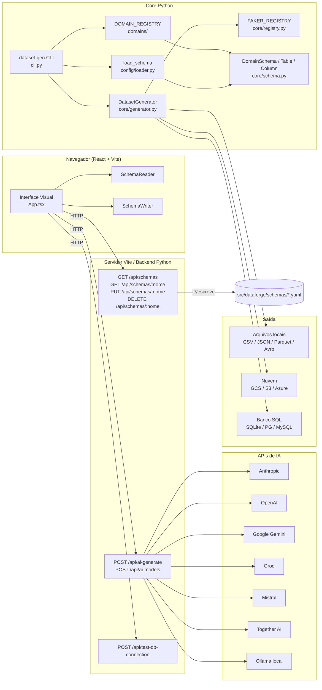
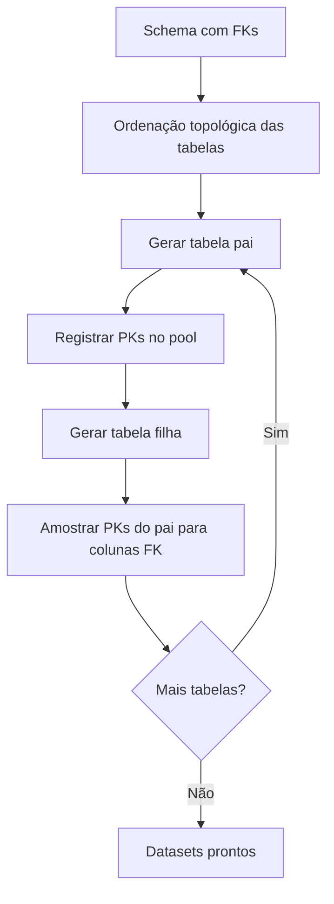

# Arquitetura

Visão técnica dos componentes do Dataforge e como eles se comunicam.

## Diagrama geral

## Componentes

### Frontend (React + TypeScript)

| Arquivo | Responsabilidade |
|---------|-----------------|
| `App.tsx` | Componente raiz; gerencia todo o estado da aplicação |
| `types/schema.ts` | Tipos TypeScript: `Column`, `Table`, `Schema` |
| `services/SchemaReader.ts` | Converte YAML em estado interno React |
| `services/SchemaWriter.ts` | Converte estado interno em YAML |
| `components/TableNode.tsx` | Nó customizado do ReactFlow para renderizar tabelas |

### Servidor (vite.config.ts)

O servidor de desenvolvimento do Vite expõe endpoints de API via proxy ou plugin. Os endpoints disponíveis são:

| Endpoint | Método | Descrição |
|----------|--------|-----------|
| `/api/schemas` | GET | Lista schemas disponíveis |
| `/api/schemas/:nome` | GET | Retorna o YAML de um schema |
| `/api/schemas/:nome` | PUT | Salva um schema no servidor |
| `/api/schemas/:nome` | DELETE | Remove um schema do servidor |
| `/api/ai-generate` | POST | Gera schema via IA |
| `/api/ai-models` | POST | Lista modelos disponíveis para o provider |
| `/api/test-db-connection` | POST | Testa uma connection string SQL |

### Core Python

| Módulo | Responsabilidade |
|--------|-----------------|
| `cli.py` | Entry point Click; define todos os comandos e flags |
| `core/schema.py` | Dataclasses: `DomainSchema`, `Table`, `Column`, `ForeignKey` |
| `core/registry.py` | `FAKER_REGISTRY` — mapeamento de dtype para função geradora |
| `core/generator.py` | `DatasetGenerator` — geração com ordenação topológica e pool de PKs |
| `config/loader.py` | Parser YAML com merge de schemas e validação de FKs |
| `domains/` | Classes de domínio pré-configuradas (ecommerce, hr, finance) |
| `uploaders/` | Implementações de upload para GCS, S3 e Azure |
| `loaders/sql_loader.py` | Carga de DataFrames em banco via SQLAlchemy |
| `writers/json_writer.py` | Escrita JSON no modo nested |

### Integridade referencial

Tabelas com FK auto-referenciada (ex: `employees.manager_id`) são preenchidas após a geração da própria tabela, usando o pool de PKs recém-criado.

## Stack de tecnologia

| Camada | Tecnologia |
|--------|-----------|
| Frontend | React 18, TypeScript, Vite, ReactFlow, Dagre |
| Backend API | Plugin Vite (Node.js) |
| CLI | Python 3.12, Click |
| Geração de dados | Faker, Pandas |
| Formatos | PyArrow (Parquet), fastavro (Avro) |
| Upload nuvem | google-cloud-storage, boto3, azure-storage-blob |
| SQL | SQLAlchemy 2.0, psycopg2-binary, pymysql |
| Build Python | poetry-core 2.0 |
| Container | Docker multi-stage (python:3.12-slim + Node.js 20 LTS) |
