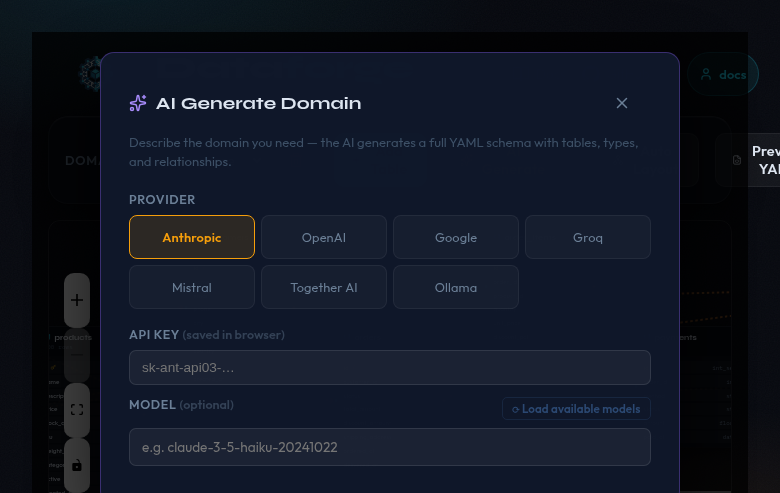
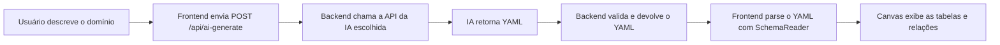

# Geração com IA

O recurso **AI Generate** permite descrever um domínio de negócio em linguagem natural e gerar automaticamente o schema YAML com tabelas, colunas, tipos de dados e relações.



## Fluxo completo



## Acessando o recurso

Clique no botão **AI Generate** na barra de ações. O modal de geração será aberto.

## Providers disponíveis

| Provider | Chave de API | Modelo padrão | Gratuito? |
|----------|-------------|--------------|-----------|
| Anthropic | `sk-ant-api03-…` | `claude-3-5-haiku-20241022` | Não |
| OpenAI | `sk-…` | `gpt-4o-mini` | Não |
| Google | `AIza…` | `gemini-2.0-flash` | Sim (free tier) |
| Groq | `gsk_…` | `llama-3.3-70b-versatile` | Sim (free tier) |
| Mistral | `xxxxxxxx…` | `mistral-small-latest` | Não |
| Together AI | `xxxxxxxx…` | `meta-llama/Llama-3.3-70B-Instruct-Turbo` | Não |
| Ollama | (sem chave) | `llama3.2` | Sim (local) |

!!! tip "Opções gratuitas recomendadas"
    **Google Gemini** (`gemini-2.0-flash`) e **Groq** (`llama-3.3-70b-versatile`) oferecem free tier generoso e são as opções recomendadas para quem não quer configurar cobrança.

    Para uso totalmente offline, o **Ollama** não requer chave de API — basta ter o serviço rodando localmente em `http://localhost:11434`.

## Configurando o provider

1. Selecione o provider desejado clicando nos botões coloridos no modal.
2. Informe a chave de API no campo correspondente (exceto para Ollama).
3. Opcionalmente, clique em **Load Models** para buscar a lista de modelos disponíveis na sua conta e selecionar um.
4. Se não selecionar um modelo, o backend usará o modelo padrão do provider.

As chaves e modelos são persistidos no `localStorage` do navegador com a chave `dataforge_ai_config`.

## Escrevendo o prompt

O campo de prompt aceita texto livre em qualquer idioma. Seja específico sobre:

- Nomes das tabelas desejadas
- Tipos de dados esperados por coluna
- Relações entre tabelas (FK)
- Intervalos de valores (ex: preço entre 10 e 2000)
- Valores fixos possíveis (ex: status: pending/processing/shipped)

### Exemplo de prompt incluído na interface

```
E-commerce with 4 tables:
- customers: full name, email, phone, city, country, registration date
- products: name, category (Electronics/Clothing/Books/Home/Sports), price (10–2000), stock quantity
- orders: linked to customer, order date (last 2 years), status (pending/processing/shipped/delivered/cancelled), total amount
- order_items: linked to order and product, quantity (1–10), unit price
```

## Endpoints utilizados

| Endpoint | Método | Descrição |
|----------|--------|-----------|
| `/api/ai-generate` | POST | Envia o prompt e o provider; recebe o YAML gerado |
| `/api/ai-models` | POST | Busca a lista de modelos disponíveis para o provider/chave |

### Payload de `/api/ai-generate`

```json
{
  "provider": "google",
  "apiKey": "AIza...",
  "model": "gemini-2.0-flash",
  "prompt": "..."
}
```

### Resposta de `/api/ai-generate`

```json
{
  "yaml": "domain: ecommerce\ntables:\n  ..."
}
```

Em caso de erro:

```json
{
  "error": "mensagem de erro",
  "yaml": "yaml parcial (se disponível)"
}
```

## Tratamento de erros comuns

| Erro | Causa | Solução |
|------|-------|---------|
| `API key is required` | Nenhuma chave foi informada | Informe a chave do provider |
| `Map keys must be unique` | A IA gerou colunas duplicadas | Tente gerar novamente ou edite o YAML |
| `AI generation failed` | Erro na API externa | Verifique a chave e o modelo escolhido |

!!! warning "Chaves de API"
    As chaves de API são armazenadas apenas no `localStorage` do seu navegador. Elas são enviadas ao backend somente no momento da chamada e não são persistidas no servidor.
